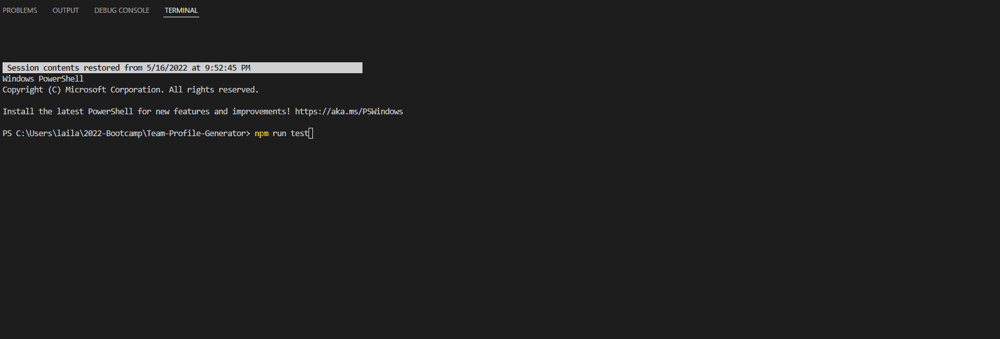

# Team Profile Generator

# Live URL 

https://sajjazaidi2015.github.io/Team-Profile-Generator/
  
# Description

This application was created to generate a team profile based on user input using the Inquirer module from Node.js and displaying the information on a newly created html page with a style sheet. This project demonstrates use of OOP and TDD using Jest.

# Installation

The user should clone the repository from GitHub and download Node. This application also requires a file system and inquirer module. If testing is required, this application uses Jest.

# Demo

## Test

## Response to Prompt

## Rendering the info in the HTML Page

